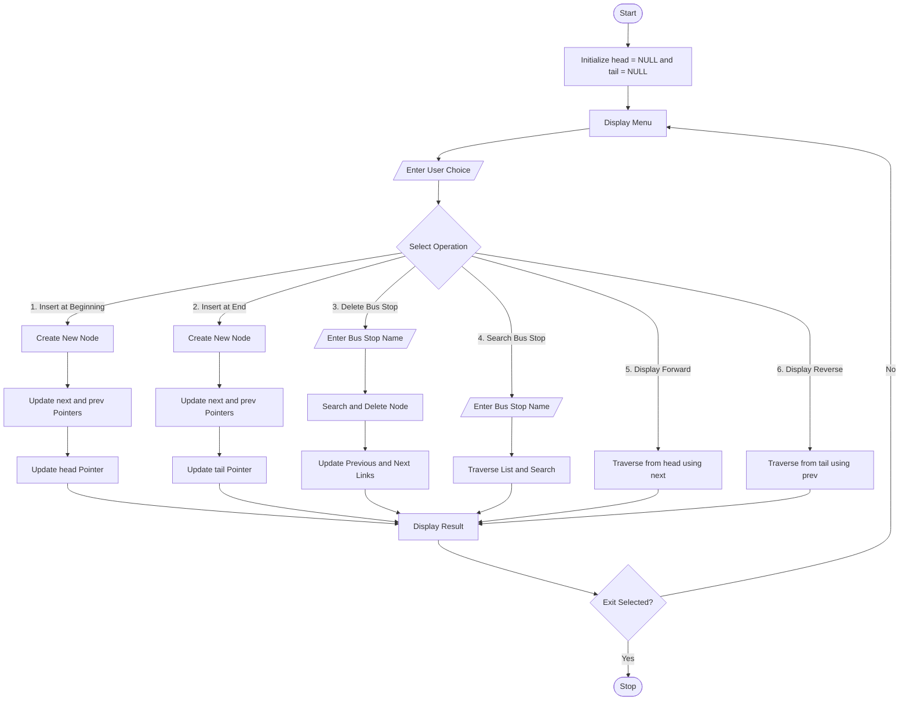

## Flowchart

```mermaid
flowchart TD
    A([Start]) --> B[Initialize head = NULL and tail = NULL]
    B --> C[Display Menu]
    C --> D[/Enter User Choice/]
    D --> E{Select Operation}

    E -->|1. Insert at Beginning| F[Create New Node]
    F --> G[Update next and prev Pointers]
    G --> H[Update head Pointer]

    E -->|2. Insert at End| I[Create New Node]
    I --> J[Update next and prev Pointers]
    J --> K[Update tail Pointer]

    E -->|3. Delete Bus Stop| L[/Enter Bus Stop Name/]
    L --> M[Search and Delete Node]
    M --> N[Update Previous and Next Links]

    E -->|4. Search Bus Stop| O[/Enter Bus Stop Name/]
    O --> P[Traverse List and Search]

    E -->|5. Display Forward| Q[Traverse from head using next]

    E -->|6. Display Reverse| R[Traverse from tail using prev]

    H --> S[Display Result]
    K --> S
    N --> S
    P --> S
    Q --> S
    R --> S

    S --> T{Exit Selected?}
    T -->|No| C
    T -->|Yes| U([Stop])
```
