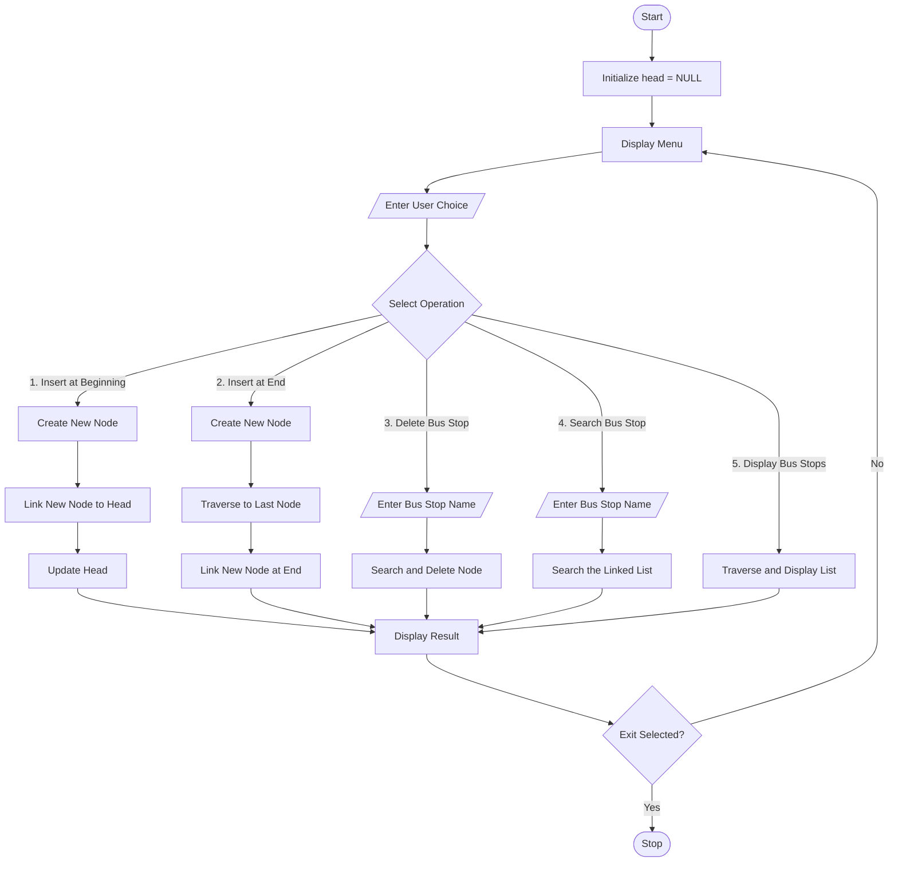

## Flowchart

```mermaid
flowchart TD
    A([Start]) --> B[Initialize head = NULL]
    B --> C[Display Menu]
    C --> D[/Enter User Choice/]
    D --> E{Select Operation}

    E -->|1. Insert at Beginning| F[Create New Node]
    F --> G[Link New Node to Head]
    G --> H[Update Head]

    E -->|2. Insert at End| I[Create New Node]
    I --> J[Traverse to Last Node]
    J --> K[Link New Node at End]

    E -->|3. Delete Bus Stop| L[/Enter Bus Stop Name/]
    L --> M[Search and Delete Node]

    E -->|4. Search Bus Stop| N[/Enter Bus Stop Name/]
    N --> O[Search the Linked List]

    E -->|5. Display Bus Stops| P[Traverse and Display List]

    H --> Q[Display Result]
    K --> Q
    M --> Q
    O --> Q
    P --> Q

    Q --> R{Exit Selected?}
    R -->|No| C
    R -->|Yes| S([Stop])
```
