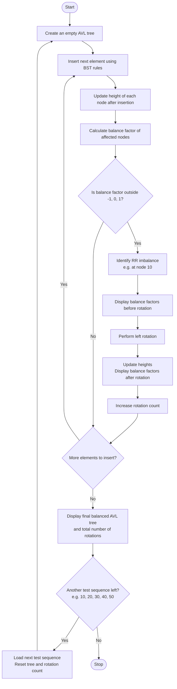

```mermaid
flowchart TD
    A([Start]) --> B["Create an empty AVL tree"]
    B --> C["Insert next element using BST rules"]
    C --> D["Update height of each node after insertion"]
    D --> E["Calculate balance factor of affected nodes"]
    E --> F{"Is balance factor outside -1, 0, 1?"}
    F -- Yes --> G["Identify RR imbalance<br/>e.g. at node 10"]
    G --> H["Display balance factors before rotation"]
    H --> I["Perform left rotation"]
    I --> J["Update heights<br/>Display balance factors after rotation"]
    J --> K["Increase rotation count"]
    K --> L
    F -- No --> L{"More elements to insert?"}
    L -- Yes --> C
    L -- No --> M["Display final balanced AVL tree<br/>and total number of rotations"]
    M --> N{"Another test sequence left?<br/>e.g. 10, 20, 30, 40, 50"}
    N -- Yes --> O["Load next test sequence<br/>Reset tree and rotation count"]
    O --> B
    N -- No --> P([Stop])
```
