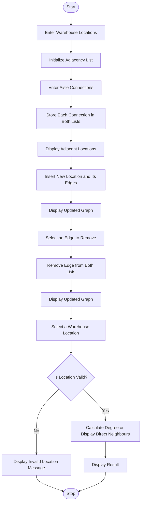

## Flowchart

```mermaid
flowchart TD
    A([Start]) --> B[Enter Warehouse Locations]
    B --> C[Initialize Adjacency List]
    C --> D[Enter Aisle Connections]
    D --> E[Store Each Connection in Both Lists]
    E --> F[Display Adjacent Locations]
    F --> G[Insert New Location and Its Edges]
    G --> H[Display Updated Graph]
    H --> I[Select an Edge to Remove]
    I --> J[Remove Edge from Both Lists]
    J --> K[Display Updated Graph]
    K --> L[Select a Warehouse Location]
    L --> M{Is Location Valid?}
    M -- No --> N[Display Invalid Location Message]
    N --> Q([Stop])
    M -- Yes --> O[Calculate Degree or Display Direct Neighbours]
    O --> P[Display Result]
    P --> Q
```
