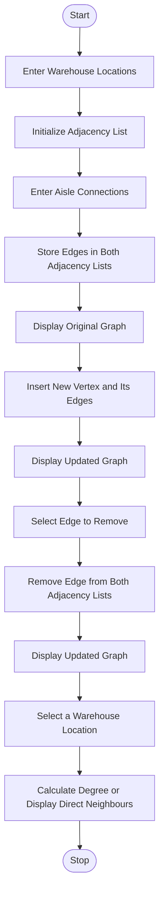

## Flowchart

```mermaid
flowchart TD
    A([Start]) --> B[Enter Warehouse Locations]
    B --> C[Initialize Adjacency List]
    C --> D[Enter Aisle Connections]
    D --> E[Store Edges in Both Adjacency Lists]
    E --> F[Display Original Graph]
    F --> G[Insert New Vertex and Its Edges]
    G --> H[Display Updated Graph]
    H --> I[Select Edge to Remove]
    I --> J[Remove Edge from Both Adjacency Lists]
    J --> K[Display Updated Graph]
    K --> L[Select a Warehouse Location]
    L --> M[Calculate Degree or Display Direct Neighbours]
    M --> N([Stop])
```
