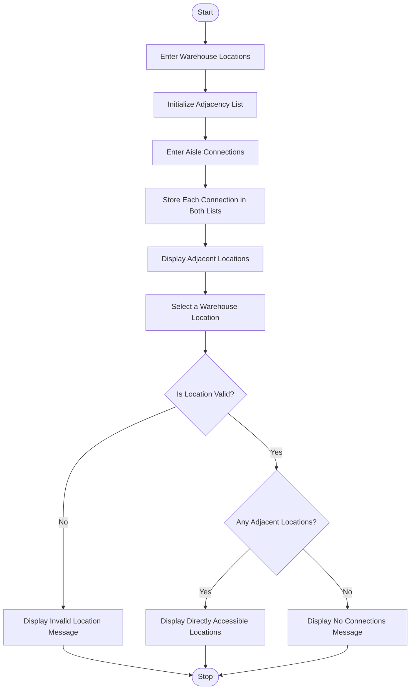

## Flowchart

```mermaid
flowchart TD
    A([Start]) --> B[Enter Warehouse Locations]
    B --> C[Initialize Adjacency List]
    C --> D[Enter Aisle Connections]
    D --> E[Store Each Connection in Both Lists]
    E --> F[Display Adjacent Locations]
    F --> G[Select a Warehouse Location]
    G --> H{Is Location Valid?}
    H -- No --> I[Display Invalid Location Message]
    I --> N([Stop])
    H -- Yes --> J{Any Adjacent Locations?}
    J -- Yes --> K[Display Directly Accessible Locations]
    J -- No --> L[Display No Connections Message]
    K --> N
    L --> N
```
